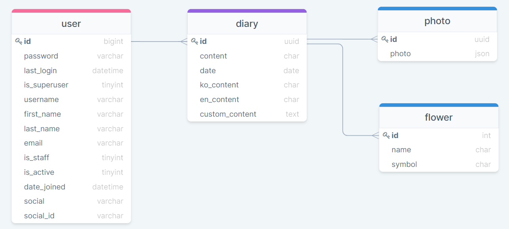
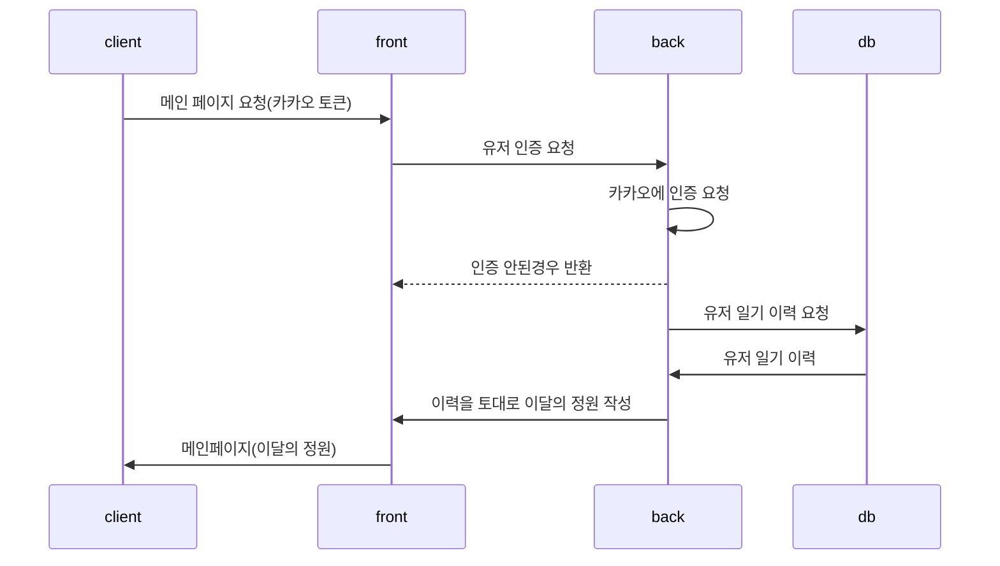
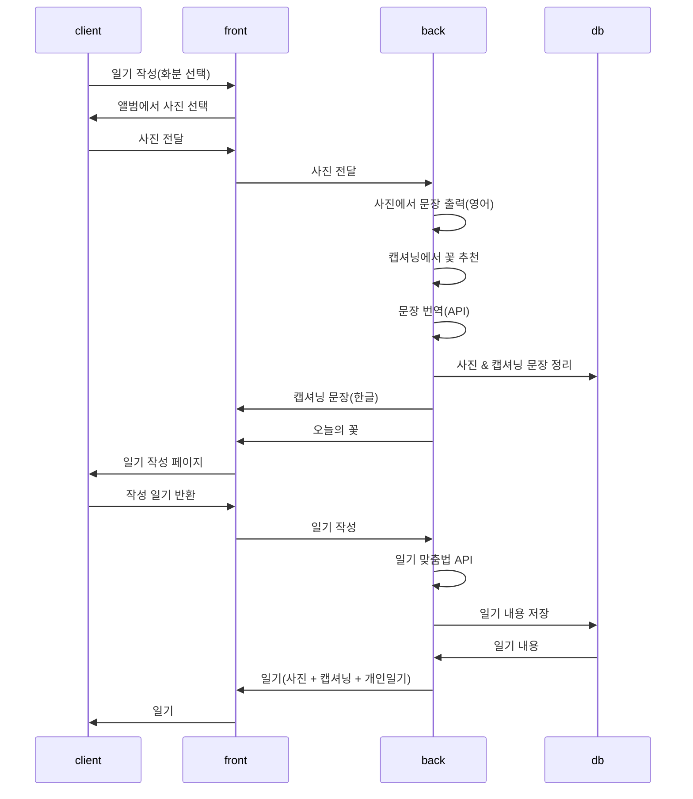
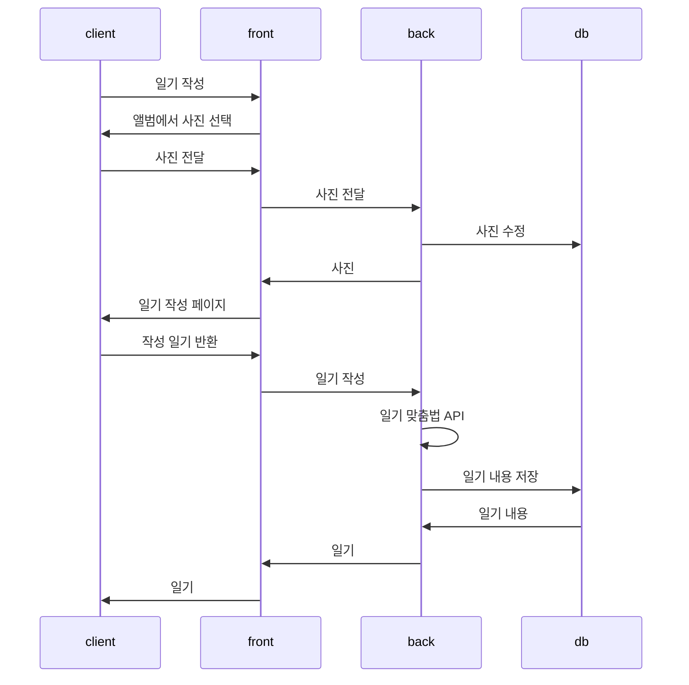

# 산출물 기록 저장소

## 와이어 프레임 & 화면 정의서
- [피그마](https://www.figma.com/file/zq49A74YZ9E5p9uN7ghcRG/특화-PJT-team-library?node-id=0%3A1)
- [화면 정의서](https://mintropy.notion.site/UI-0e6a29fdbc5346e2ad4a3544df18f61a)

## ERD
- [ERD](https://www.notion.so/mintropy/ERD-f6074c6dd90c4306b3d17e3c07e3a165)

- 각 유저가 일기를 작성
    - 일기와 함께 사진 업로드
    - 일기에 해당하는 꽃을 추천

## 시퀀스 다이어그램
- [시퀀스 다이어그램](https://www.notion.so/mintropy/5551842c096a450a83cc807df7069583)

## 시스템 구성도

