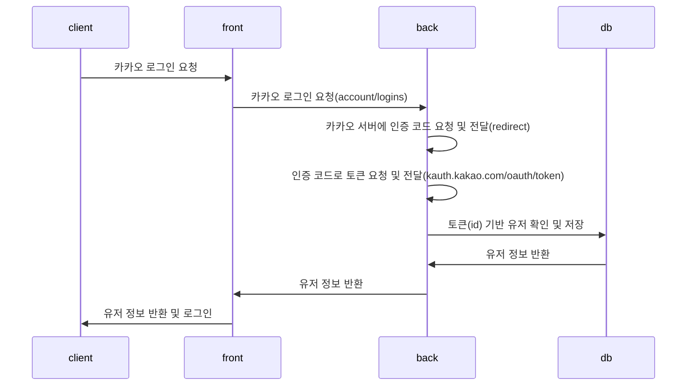
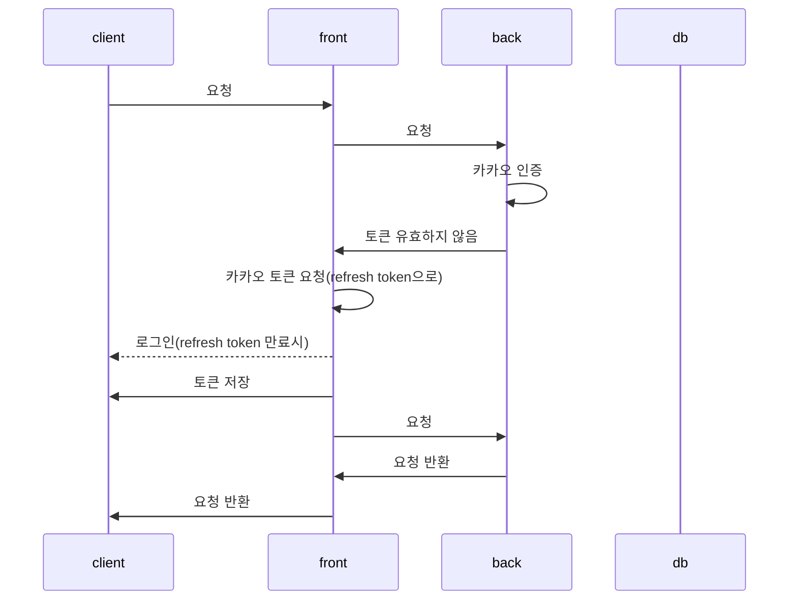
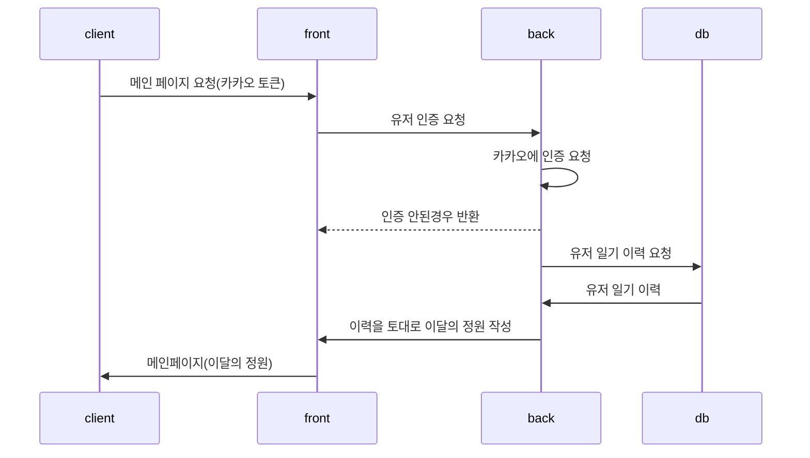
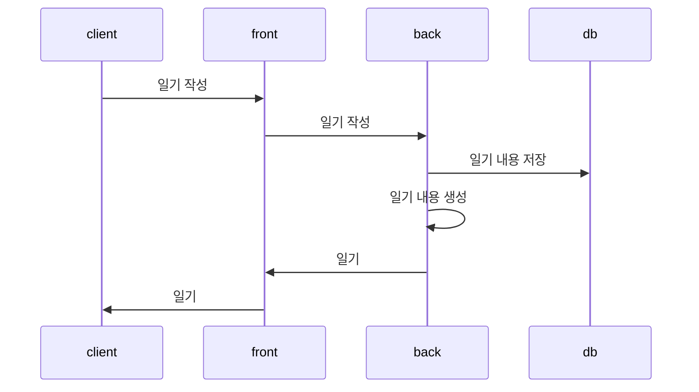

# 산출물 기록 저장소

## 와이어 프레임 & 화면 정의서
- [피그마](https://www.figma.com/file/zq49A74YZ9E5p9uN7ghcRG/특화-PJT-team-library?node-id=0%3A1)

## ERD
- [ERD](https://www.notion.so/mintropy/ERD-f6074c6dd90c4306b3d17e3c07e3a165)

- 각 유저가 일기를 작성
    - 일기와 함께 사진 업로드
    - 일기에 해당하는 꽃을 추천

## 시퀀스 다이어그램

## 시스템 구성도

### 프론트엔드
- Kotlin, Android

### 백엔드
- Python
- Django
    - DRF

### AI
- Python
- TensorFlow
